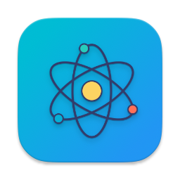

# TahoeElectronFix

<p align="center">
  
</p>

<p align="center">
  <strong>A lightweight macOS menu bar app to control Chrome's headless mode</strong>
</p>

<p align="center">
  <a href="#features">Features</a> •
  <a href="#installation">Installation</a> •
  <a href="#usage">Usage</a> •
  <a href="#building">Building</a> •
  <a href="#support">Support</a>
</p>

---

## Overview

TahoeElectronFix is a SUPER-light and extremely simple macOS menu bar utility that allows you to easily toggle the `CHROME_HEADLESS` environment variable. This is particularly useful for users of MacOS Tahoe running Electron apps that haven't been updated to the bug fixed Electron version.This setting saves a lot of load on the system and therefore preserves battery life.

## Features

- 🎯 **Simple Toggle** - One click to enable/disable Chrome headless mode
- 🔄 **Persistent State** - Remembers your preference across restarts
- 🚀 **Launch at Login** - Optional automatic startup
- 💻 **Menu Bar Integration** - Unobtrusive menu bar icon
- ⚡ **Instant Effect** - Changes take effect immediately for new processes
- 🎨 **Visual Feedback** - Icon changes based on current state

## Requirements

- macOS 13.0 (Ventura) or later
- No App Sandbox (the app needs to set global environment variables)

## Installation

### Download

1. Download the latest `.dmg` file from the [Releases](https://github.com/yourusername/TahoeElectronFix/releases) page
2. Open the `.dmg` file
3. Drag **TahoeElectronFix** to your Applications folder
4. Launch the app
5. **First time only**: Right-click the app and select "Open" to bypass Gatekeeper

### Build from Source

See [Building from Source](#building-from-source) below.

## Usage

### Basic Operation

1. **Launch the app** - An atom icon (⚛️) will appear in your menu bar
2. **Left-click** the icon to toggle `CHROME_HEADLESS` on/off
   - **Solid icon** = Headless mode ON (`CHROME_HEADLESS=1`)
   - **Greyed icon** = Headless mode OFF (`CHROME_HEADLESS=0`)
3. **Right-click** to access the menu:
   - **Start at Launch** - Enable/disable automatic startup
   - **Offer a coffee to the dev...** - Support the developer ☕
   - **Quit** - Exit the application

### Hover Tooltip

Hover over the menu bar icon to see the current value: `CHROME_HEADLESS 0` or `CHROME_HEADLESS 1`

### Verification

To verify the environment variable is set correctly, open Terminal and run:

```bash
launchctl getenv CHROME_HEADLESS
```

## Building from Source

### Prerequisites

- Xcode 15.0 or later
- macOS 13.0 SDK or later

### Build Steps

1. **Clone the repository:**
   ```bash
   git clone https://github.com/realAbitbol/TahoeElectronFix.git
   cd TahoeElectronFix
   ```

2. **Open in Xcode:**
   ```bash
   open TahoeElectronFix.xcodeproj
   ```

3. **Configure signing:**
   - Select the project in Xcode
   - Go to "Signing & Capabilities"
   - Choose your development team
   - **Important**: Remove "App Sandbox" if present

4. **Build:**
   - Select **Product → Build** (⌘B)
   - Or run directly with **Product → Run** (⌘R)

5. **Create distributable app:**
   - **Product → Archive**
   - **Distribute App → Copy App**
   - Save to desired location

### Creating a DMG

You can create a DMG manually using the provided script or wait for the automated GitHub Actions build.

## How It Works

TahoeElectronFix sets the global `CHROME_HEADLESS` environment variable using `launchctl setenv`. This makes the variable available to all GUI applications launched after the variable is set.

The app:
1. Maintains state in UserDefaults
2. Runs `launchctl setenv CHROME_HEADLESS <value>` on toggle
3. Restores the last saved state on app launch
4. Initializes to ON (1) on first run

## Troubleshooting

### The environment variable isn't being set

- Make sure **App Sandbox is disabled** in Xcode (Signing & Capabilities)
- Verify the app is running (check menu bar for atom icon)
- Check Terminal: `launchctl getenv CHROME_HEADLESS`

### "App is damaged" error

If you downloaded the app:
- Right-click the app → "Open" (first time only)
- Or run: `xattr -cr /Applications/TahoeElectronFix.app`

### Menu bar icon not showing

- Try running the built app directly (not from Xcode)
- Check System Settings → Control Center for hidden icons

## Support

If you find this app useful, consider [buying me a coffee](https://ko-fi.com/realabitbol) ☕

## License

MIT Licence

## Contributing

Contributions are welcome! Please feel free to submit a Pull Request.

## Credits

Created by realAbitbol

---

<p align="center">
  Made with ❤️ for the MacOS community
</p>
